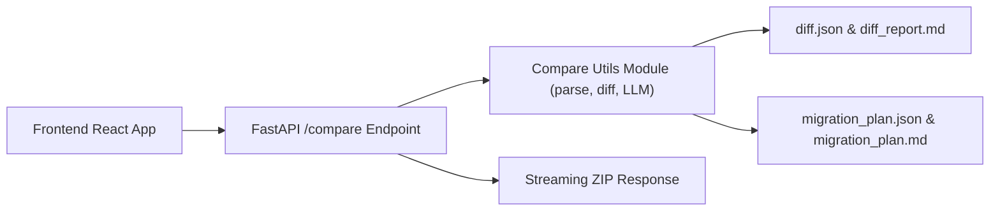

# Project Overview

This document provides a high-level overview of the **SQL Cleanser** project architecture, including the new `/compare` functionality for robust data migration.

## Architecture Diagram

## `/compare` Flow

1. **Client** (React) uploads two file sets: `base_files[]` (PostgreSQL) and `oracle_files[]` (Oracle).
2. **FastAPI** `/compare` endpoint:
   - Saves uploads to a new `jobs/<id>/{base,oracle}` folder.
   - Invokes **Compare Utils** to parse, infer keys, sort, compute diffs, call LLM, and generate reports.
   - Streams back a ZIP file containing all artifacts.
3. **Compare Utils**:
   - **Parsing**: Reads INSERT statements from both datasets (supports `.sql` and `.txt`).
   - **PK Inference**: Uses Ollama LLM to detect primary key columns.
   - **Sorting**: Orders rows by primary key for consistent diff.
   - **Diff Computation**: Identifies missing, extra, and mismatched rows (global + per-table).
   - **LLM Classification**: Generates a migration guide and structured migration plan via Ollama (3 retries, 120s timeout).
   - **Packaging**: Emits `diff.json`, `diff_report.md`, `migration_plan.md`, `migration_plan.json`, and zips them.

This flow ensures a robust, end-to-end migration check and guide for your SQL datasets.
